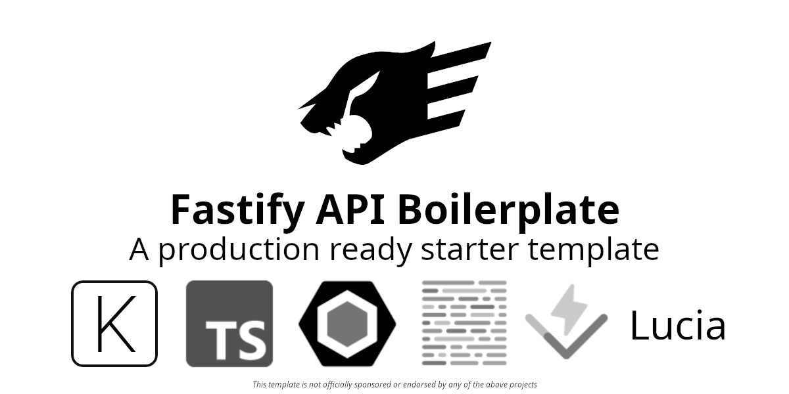

# Fastify API Boilerplate



Everything you need to kick off your next Fastify API!

## Table of Contents

- [Overview](#overview)
- [Included Fastify Plugins](#included-fastify-plugins)
- [Requirements](#requirements)
- [Getting Started](#getting-started)
- [Important Note](#important-note)
- [Testing](#testing)
- [Preparing for Deployment](#preparing-for-deployment)
- [DevTools](#devtools)
- [Installed Packages](#installed-packages)

## Overview

Built with type safety, scalability, and developer experience in mind. A batteries included Fastify API template.

- [pnpm](https://pnpm.io) - A strict and efficient alternative to npm with up to 3x faster performance
- [TypeScript](https://www.typescriptlang.org) - A typed superset of JavaScript designed with large scale applications in mind
- [ESLint](https://eslint.org) - Static code analysis to help find problems within a codebase
- [Prettier](https://prettier.io) - An opinionated code formatter
- [Fastify](https://fastify.dev) - A web framework highly focused on providing the best developer experience with the least overhead and a powerful plugin architecture
- [Kysely](https://kysely.dev) - A type-safe and autocompletion-friendly TypeScript SQL query builder
- [Lucia](https://lucia-auth.com) - An auth library written in TypeScript that abstracts away the complexity of handling sessions
- [TypeBox](https://github.com/sinclairzx81/typebox) - Json Schema Type Builder with Static Type Resolution for TypeScript
- [Vitest](https://vitest.dev) - A blazing fast unit test framework powered by Vite
- [Dayjs](https://day.js.org/en/) - A minimalist JavaScript library that parses, validates, manipulates, and displays dates and times for modern browsers
- [Husky](https://github.com/typicode/husky) + [Commitizen](https://github.com/commitizen/cz-cli#readme) + [Commitlint](https://github.com/conventional-changelog/commitlint#readme) - Git hooks and commit linting to ensure use of descriptive and practical commit messages
- [ts-reset](https://github.com/total-typescript/ts-reset) - Improvements for TypeScripts built-in typings for use in applications
- [cross-env](https://github.com/kentcdodds/cross-env) - Run scripts that set and use environment variables across platforms

A more detailed list of the included packages can be found in the [Installed Packages](#installed-packages) section.

## Included Fastify Plugins

Fastify provides a robust [ecosystem](https://fastify.dev/ecosystem/) of officially maintained and community maintained plugins. Below are the plugins included in this project.

- [@fastify/autoload](https://github.com/fastify/fastify-autoload) - Loads all plugins found in a directory and automatically configures routes matching the folder structure
- [@fastify/caching](https://github.com/fastify/fastify-caching) - Provides server-side caching and mechanisms for manipulating HTTP cache headers according to RFC 2616 §14.9
- [@fastify/cookie](https://github.com/fastify/fastify-cookie) - A plugin for Fastify that adds support for reading and setting cookies
- [@fastify/cors](https://github.com/fastify/fastify-cors) - Enables the use of CORS in a Fastify application
- [@fastify/csrf-protection](https://github.com/fastify/csrf-protection) - This plugin helps developers protect their Fastify server against CSRF attacks
- [@fastify/env](https://github.com/fastify/fastify-env) - Fastify plugin to check environment variables
- [@fastify/formbody](https://github.com/fastify/fastify-formbody) - Adds a content type parser for the content type application/x-www-form-urlencoded
- [@fastify/helmet](https://github.com/fastify/fastify-helmet) - Important security headers for Fastify via helmet
- [@fastify/multipart](https://github.com/fastify/fastify-multipart) - Fastify plugin to parse the multipart content-type
- [@fastify/rate-limit](https://github.com/fastify/fastify-rate-limit) - A low overhead rate limiter for your routes
- [@fastify/sensible](https://github.com/fastify/fastify-sensible) - Defaults for Fastify that everyone can agree on
- [@fastify/swagger](https://github.com/fastify/fastify-swagger) - Serve and generate Swagger (OpenAPI v2) or OpenAPI v3 schemas from your routes or an existing Swagger/OpenAPI schema
- [@fastify/swagger-ui](https://github.com/fastify/fastify-swagger-ui) - A Fastify plugin for serving Swagger UI
- [@fastify/type-provider-typebox](https://github.com/fastify/fastify-type-provider-typebox) - A Type Provider for Typebox
- [@fastify/under-pressure](https://github.com/fastify/under-pressure) - Measure process load with automatic handling of "Service Unavailable" plugin for Fastify
- [@fastify/websocket](https://github.com/fastify/fastify-websocket) - WebSocket support for Fastify
- [fastify-plugin](https://github.com/fastify/fastify-plugin) - A plugin helper for Fastify

[@fastify/autoload](https://github.com/fastify/fastify-autoload) is used to automatically register the above plugins. They can be found in the src/common/plugins directory. Where possible, plugins are passed their respective options object with default configs (provided by the plugins documentation) to allow for quicker configuration of each plugin.

## Requirements

- [NodeJS 18+](https://nodejs.org/en)
- [pnpm](https://pnpm.io) (or equivalent)

If you'd like to use the included Dockerfile then [Docker](https://www.docker.com) is required as well

## Getting Started

Getting started is a simple as cloning the repository

```
git clone git@github.com:RicardoValdovinos/fastify-api-boilerplate.git
```

Changing into the new directory

```
cd fastify-api-boilerplate
```

Removing the .git folder (and any additional files, folders or dependencies you may not need)

```
rm -rf .git
```

Installing dependencies

```
pnpm install
```

And running the setup script (initializes git repository and husky)

```
pnpm run setup
```

Congrats! You're ready to starting working on that new project!

If you'd rather run the commands above in one go, check out the command below:

```
git clone git@github.com:RicardoValdovinos/fastify-api-boilerplate.git &&\
cd fastify-api-boilerplate &&\
rm -rf .git &&\
pnpm install &&\
pnpm run setup
```

**Note**: This project comes with two git hooks added by [husky](https://typicode.github.io/husky/). A prepare-commit-msg hook to run the [Commitizen](https://github.com/commitizen/cz-cli#readme) cli for those nice commit messages and a commit-msg hook to run [Commitlint](https://commitlint.js.org/#/) on the message itself. Commitlint will ensure the commit message follows the [Conventional Commits specification](https://www.conventionalcommits.org/en/v1.0.0/) (it will if you used commitizen).

If you wish to remove any hooks, simply delete the corresponding file in the .husky directory.

## Important Note

1. This boilerplate project includes a basic example module to demonstrate the [recommended module organizational structure](src/modules/README.md). The module itself is self contained (thanks to [Fastify's Encapsulation](https://fastify.dev/docs/latest/Reference/Encapsulation/)), meaning it can be modified or deleted without worry. To help with overall project understanding, README files have been included in relevant folders containing simple descriptions about how the different directories in the accompanying directory structure may be used. These README files can be found in the following directories:
   - [src/common](src/common/README.md)
   - [src/configs](src/configs/README.md)
   - [src/modules](src/modules/README.md)
   - [src/modules/example](src/modules/example/README.md)

To remove all README files and example code execute the following command from the projects root directory:

`rm -r ./src/common/README.md ./src/configs/README.md ./src/modules/README.md ./src/modules/example/README.md ./src/modules/example`

## Testing

Unit testing is handled by Vitest.

If you'd like to run all tests execute the following command:

```
pnpm run test
```

### Unit Testing

When running unit test scripts, it is assumed that unit tests will be colocated with the source files.

If you'd like to execute unit tests specifically, the below command will execute vitest:

```
pnpm run test:unit
```

If instead you are interested in coverage reporting, run:

```
pnpm run test:unit:coverage
```

All unit tests run in watch mode by default. If you'd like to disable watch mode, change the package.json test scripts with the following

before:

```
"scripts": {
  	"test:unit": "vitest src/",
	"test:unit:coverage": "vitest --coverage src/"
}
```

After:

```
"scripts": {
  	"test:unit": "vitest run src/",
	"test:unit:coverage": "vitest run --coverage src/"
}
```

## Preparing for Deployment

Instructions are provided for deploying both with and without Docker. Both options still require a platform to host the application.

### Without Docker

Deploying is as easy as running

```
pnpm run build
```

followed by

```
pnpm run start
```

and pointing incoming requests via your web server to the fastify servers url and port

### With Docker

A Dockerfile is also provided for quick and easy deployments. Simply execute the following commands:

1. `pnpm run build`
2. `docker build . -t <container_name>`
   - Example: `docker build . -t todo-api`
3. `docker run  -p <port_number>:3000 <container_name>`
   - Example: `docker run -p 3000:3000 todo-api`

### Continuous Integration

Due to the vast array of tools, opinions, requirements and preferences a CI template is not included in this project.

## Devtools

This project includes a `development-only.ts` plugin in `src/common/plugins` where you can register/run development exclusive code.

## Installed Packages

A simplified list can be found in the [Overview](#overview) section.

### Base

- [TypeScript](https://www.typescriptlang.org)
- [Fastify](https://vitejs.dev)

### Fastify Plugins

- [@fastify/autoload](https://github.com/fastify/fastify-autoload)
- [@fastify/caching](https://github.com/fastify/fastify-caching)
- [@fastify/cookie](https://github.com/fastify/fastify-cookie)
- [@fastify/cors](https://github.com/fastify/fastify-cors)
- [@fastify/csrf-protection](https://github.com/fastify/csrf-protection)
- [@fastify/env](https://github.com/fastify/fastify-env)
- [@fastify/formbody](https://github.com/fastify/fastify-formbody)
- [@fastify/helmet](https://github.com/fastify/fastify-helmet)
- [@fastify/multipart](https://github.com/fastify/fastify-multipart)
- [@fastify/rate-limit](https://github.com/fastify/fastify-rate-limit)
- [@fastify/sensible](https://github.com/fastify/fastify-sensible)
- [@fastify/swagger](https://github.com/fastify/fastify-swagger)
- [@fastify/swagger-ui](https://github.com/fastify/fastify-swagger-ui)
- [@fastify/type-provider-typebox](https://github.com/fastify/fastify-type-provider-typebox)
- [@fastify/under-pressure](https://github.com/fastify/under-pressure)
- [@fastify/websocket](https://github.com/fastify/fastify-websocket)
- [fastify-plugin](https://github.com/fastify/fastify-plugin)

### Linting & Formatting

- [Prettier](https://prettier.io)
- [ESLint](https://eslint.org)
  - [typescript-eslint](https://typescript-eslint.io)
  - [eslint-config-prettier](https://github.com/prettier/eslint-config-prettier#readme)
  - [@eslint/js](https://eslint.org)
  - [typescript-eslint](https://typescript-eslint.io/getting-started)
  - [eslint-plugin-n](https://github.com/eslint-community/eslint-plugin-n)
  - [eslint-plugin-security](https://github.com/eslint-community/eslint-plugin-security)
  - [eslint-plugin-unicorn](https://github.com/sindresorhus/eslint-plugin-unicorn#readme)

### Schema Validation

- [TypeBox](https://github.com/sinclairzx81/typebox)

## Database

- [Kysely](https://kysely.dev)
- [kysely-codegen](https://github.com/RobinBlomberg/kysely-codegen)
- [better-sqlite3](https://github.com/WiseLibs/better-sqlite3)

## Authentication

- [Lucia](https://lucia-auth.com)
- [@lucia-auth/adapter-sqlite](https://lucia-auth.com/database/sqlite)
- [Arctic](https://arctic.js.org)
- [Oslo](https://oslo.js.org)

### Testing

- [Vitest](https://vitest.dev)
- [coverage-v8](https://vitest.dev/guide/coverage)

### Git

- [Husky](https://github.com/typicode/husky#readme)
- [Commitizen](https://github.com/commitizen/cz-cli#readme)
- [Commitlint](https://github.com/conventional-changelog/commitlint#readme)

### Other

- [cross-env](https://github.com/kentcdodds/cross-env)
- [Dayjs](https://day.js.org/en/)
- [dotenv](https://www.dotenv.org)
- [ts-reset](https://github.com/total-typescript/ts-reset#readme)
- [undici](https://github.com/nodejs/undici)
